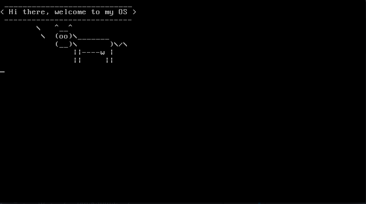

# OS
An OS created from scratch by me. This OS was made for learning purposes.



## Development prerequisites
To compile `nasm` is required and to simulate `qemu-system` is required.
On Ubuntu:
```
$ sudo apt install nasm qemu-system
```

## Building

Simply clone this repo, then:

```
$ make
$ ./run
```
